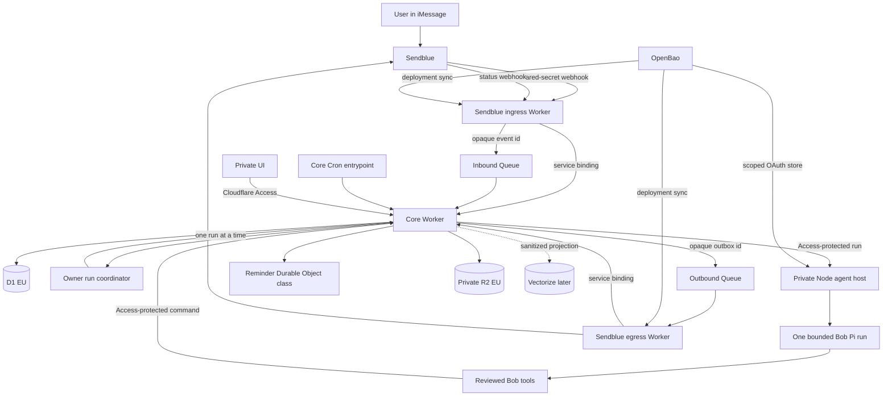

# Bob project plan

Status: initial architecture plan  
Updated: 2026-08-11

[`CONTEXT.md`](../CONTEXT.md) defines Bob's canonical domain terms and invariants.

## 1. Product goal

Bob is a private continuity assistant for one person.

The primary interface is iMessage through Sendblue.

The long-term goal is a general personal continuity agent with bounded authority.

Bob can understand broad day-to-day goals and plan across approved services.

Bob gains new authority only through reviewed domain capabilities.

Bob helps with these tasks:

- Create, acknowledge, snooze, and cancel reminders.
- Recall routines, facts, plans, and prior decisions.
- Set up gyms, equipment, exercises, and training routines.
- Log workouts, sets, repetitions, weight, and notes.
- Capture journal entries and find old entries.
- Surface important information at useful times.
- Explain where each recalled fact came from.

Bob supports memory. It does not diagnose or treat dementia.

Bob must not become the only medication, emergency, or safety system.

## 2. Product principles

1. Keep one stable interface.
2. Use short and predictable messages.
3. Show dates, times, sources, and completion state.
4. Ask before changing important facts or routines.
5. Preserve corrections and conflicting statements.
6. Make every action reversible when possible.
7. Keep raw records separate from summaries.
8. Treat indexes and embeddings as replaceable data.
9. Keep model access behind Pi's provider seam.
10. Give the agent only reviewed domain tools with explicit authority.

[Personal agent interaction research](research/personal-agent-interaction.md) records the research
basis for personalization, proactive help, human control, and continuous improvement.

Its proactive harness roadmap defines the approved signal path, rollout stages, and release checks.

OpenClaw, Hermes, Waku, and Boop are design references.

They are not runtime dependencies.

## 3. Decisions made

### Pi and Codex

- There is no current npm package named `pi-core-sdk`.
- Pi packages use ESM and require Node.js 22.19 or newer.
- Use `@earendil-works/pi-ai` for production model access and provider support.
- Production must register providers and load credentials and context.
- Production must also define login and session policies.
- Run Pi in a private Node service.
- Do not run the full Pi coding SDK inside a Cloudflare Worker.
- Provide an explicit custom-tool allowlist.
- Expose only reviewed Bob domain tools.
- Use Pi's `openai-codex` provider as a subscription feasibility candidate.
- Keep an API-key provider as an explicitly enabled fallback.
- Never switch to API-key billing automatically.

The local Pi CLI is version 0.82.1. The 2026-08-10 registry version is 0.84.1.

Pin all direct Pi packages to the same exact version.

Run the agent host against workspace packages. Do not rely on the global Pi CLI.

The ChatGPT Pro fee is not an API credit balance.

ChatGPT Pro provides bounded Codex usage. Limits depend on the model.

The plan can also include weekly limits.

API-key usage has separate billing and separate data controls.

Pi implements ChatGPT OAuth for its `openai-codex` provider.

[ADR 0001](adr/0001-pi-openai-codex-auth.md) defines Bob's login, storage, and refresh contract.

Boop Agent is the closest public Sendblue and Codex subscription example.

No public Sendblue integration for Pi was found.

It runs a local Codex app server with credentials from `codex login`.

Bob adopts its channel shape. Bob uses Pi AI for model access.

This public example does not establish OpenAI support for Bob's intended use.

A local Pi profile contains an `openai-codex` credential. Model enumeration works.

These checks do not prove remote token validity, refresh, quota, or inference.

Do not copy `~/.codex/auth.json` over Pi's authentication file. Their formats differ.

ChatGPT OAuth requests follow ChatGPT account or workspace data controls.

API-key requests follow OpenAI API organization controls.

Do not apply API retention assumptions to subscription requests.

Official OpenAI documentation does not establish this non-coding, always-on entitlement.

Treat subscription access as a feasibility assumption.

Complete one live request and a current policy review.

Keep the provider replaceable. Fail closed when authentication or quota fails.

### Cloudflare

Use Cloudflare for these parts:

- Webhook ingress
- Internal API
- Queue delivery
- Reminder scheduling
- Canonical application data
- Private object storage
- Private administration UI
- Access control

Use these products:

- Workers
- Queues
- Durable Objects
- Cron Triggers
- D1
- R2
- Access
- Vectorize later

Create D1, R2, and Durable Objects in an EU jurisdiction.

EU jurisdiction limits resource placement. It does not restrict all Worker processing.

Sendblue can still process data globally.

Keep sensitive text out of Queues. Queue messages contain opaque record identifiers.

### Application and infrastructure stack

Use Alchemy for Bob-owned Cloudflare application infrastructure.

Keep Kubernetes and OpenBao resources with their current tools.

One tool owns each Cloudflare resource.

Do not let Alchemy, Wrangler, and OpenTofu manage the same resource.

Use Effect v4 for typed I/O composition, validation, cancellation, and expected errors.

Keep pure domain rules as normal TypeScript.

Use Drizzle for D1 table schemas and queries.

Keep database code with the domain module that owns its invariants.

Pin this exact prerelease set:

- `alchemy@2.0.0-beta.70`
- `effect@4.0.0-beta.107`
- All direct `@effect/*` packages at `4.0.0-beta.107`
- `drizzle-orm@1.0.0-rc.4`
- `drizzle-kit@1.0.0-rc.4`

Use Varlock for environment schemas, validation, and command injection.

Pin this exact environment set:

- `varlock@1.16.1`
- `@varlock/hashicorp-vault-plugin@2.1.0`

OpenBao remains the secret authority.

Run Alchemy and the private Node service through `varlock run --inject vars --skip-cache --`.

Do not use `varlock-wrangler` because Alchemy owns Worker deployments.

Do not place Pi OAuth credentials in environment variables.

Do not use version ranges or moving tags.

Upgrade these packages in one reviewed change.

Use TypeScript 5.9 or newer with strict checks.

[ADR 0004](adr/0004-alchemy-effect-drizzle.md) defines stack ownership and safety rules.

[ADR 0005](adr/0005-varlock-environment-contracts.md) defines environment and secret-loading rules.

### Sendblue

Treat Sendblue as an untrusted notification channel.

The current account uses Free API Mode and a shared Sendblue line.

It has one verified personal contact.

The dashboard now has a 64-character global webhook secret.

No webhook endpoint is configured because Bob has no deployed Worker URL.

Add the inbound and outbound endpoints after the ingress Worker has a stable URL.

[ADR 0002](adr/0002-sendblue-agent-channel.md) defines the automatic channel and webhook reconciliation.

Run the reconciler after each ingress deployment or explicit configuration change.

The reconciler reads current hooks before it changes the account.

It preserves unrelated hooks and fails when the global secret differs.

Do not use a blind `PUT`. It replaces the account webhook configuration.

- Compare `sb-signing-secret` with a timing-safe equality check.
- Do not describe this shared secret as an HMAC signature.
- Validate HTTPS, body size, schema, sender, destination, and event type.
- Accept messages only from an allowlisted phone number.
- Deduplicate inbound events with `message_handle`.
- Record delivery attempts before sending.
- Do not retry an uncertain outbound send without review.
- Do not treat `delivered` as user acknowledgment.
- Ask for a simple reply such as `done`.
- Disclose that replies come from an AI assistant.

Do not expose the Sendblue MCP server to Pi.

It is an API tool set. It is not the durable inbound channel.

Sendblue can fall back to SMS. The account cannot disable this fallback globally.

All message text must therefore be safe for SMS previews.

Use an authenticated UI link for sensitive details.

When Sendblue reports `opted_out`, stop every outbound message.

Explain the `START` recovery path in the private UI.

### Memory foundation

Use the application database as the source of truth.

Export human-readable, Obsidian-compatible Markdown.

Do not use Obsidian as the reminder transaction database.

Do not use AgentFS as the primary personal knowledge store.

Do not use a graph-first ontology in the first release.

Borrow entity and relationship ideas from AgentOS later.

Do not add AgentOS as a runtime dependency.

The Obsidian vault is a one-way export projection in the first release.

Editing exported Markdown does not update Bob.

Each file contains a schema version, stable record ID, source IDs, and a content hash.

Exclude sensitive journal text from plain exports by default.

Require confirmation and encryption for a full export.

AgentFS remains optional for later audit or sandbox state.

AgentFS is beta. It is not a personal-data model.

`AgentOS` means the design at `agentos.to` in this plan.

### Reference patterns adopted

Adopt these OpenClaw patterns:

- One channel gateway around one agent loop.
- Typed tools with permissions enforced in code.
- Separate raw daily records and compact durable memory.
- Hybrid retrieval with recency and importance.
- A scheduler outside the model.
- Origin classes, supersession, and promotion gates.
- Compile standing intents into typed records.

Do not treat OpenClaw's in-process session queue as durable.

Adopt these Hermes patterns:

- A strict limit for always-loaded memory.
- Fresh sessions for scheduled jobs.
- Narrow tool sets for each job.
- Staged memory and skill changes.
- Fail-closed scheduled actions.
- A durable external-action ledger with an unknown outcome state.
- Content-free health telemetry.

Adopt these Waku patterns:

- One visible composition module for each deployable.
- One bounded context and one bounded agent run.
- Semantic, episodic, and procedural memory views.
- Deterministic workflows around the agent loop.
- Separate deterministic and judged evaluations.
- A deterministic release gate for safety behavior.

Do not adopt Waku's automatic fact promotion.

Do not adopt its raw-content traces or self-editing skills.

Do not add its second agent loop or generic graph engine.

Adopt Boop's Sendblue account reconciliation and task-scoping patterns.

Use a fixed work receipt only when a slow request needs one.

That receipt never means delivery, acknowledgment, or task completion.

Do not adopt Boop's prompt-only enforcement or process-local timers.

Do not adopt its direct provider send path or full-content logs.

Do not copy any reference framework as a whole.

[ADR 0003](adr/0003-agent-runtime-and-repository-seams.md) defines the agent and repository seams.

## 4. System architecture



### Runtime boundaries

#### Sendblue ingress Worker

- Compare the webhook shared secret with timing-safe equality.
- Do not assume Sendblue provides payload signing or replay timestamps.
- Enforce the sender allowlist.
- Validate destination, event type, schema, and body size.
- Normalize provider events.
- Store idempotent events through a core service binding.
- Publish only opaque event identifiers to the inbound Queue.
- Return `2xx` only after durable acceptance.
- Return `5xx` if durable queue publication fails.
- Hold no outbound Sendblue credentials.

Test whether status callbacks contain the shared-secret header.

Sendblue does not document that behavior.

#### Sendblue egress Worker

- Hold only outbound Sendblue credentials.
- Consume opaque outbox identifiers.
- Claim and fetch SMS-safe content through a core service binding.
- Record a dispatch attempt before the provider call.
- Record provider acceptance, failure, or uncertainty.
- Never receive Pi or OpenBao OAuth credentials.

#### Core Worker

- Own D1, R2, and Durable Object bindings.
- Consume the inbound Queue.
- Own the Cron and reminder-clock entrypoints.
- Enforce all data permissions.
- Expose typed internal and UI routes.
- Keep domain invariants outside the model prompt.
- Keep audit events append-only during normal operation.
- Serialize agent runs through an owner-scoped Durable Object.
- Keep D1 claims authoritative for run state.
- Build one immutable, policy-cleared context pack per run.
- Call the Node host through Cloudflare Access.
- Store the run result and response outbox in D1.

#### Node agent host

- Run Bob's bounded loop over Pi AI.
- Load reviewed instructions and tools.
- Render the supplied context pack.
- Return one validated run result.
- Never call Sendblue directly.
- Never receive Cloudflare administrator credentials.
- Create one ephemeral Pi model context for each run.
- Apply deadlines and abort signals to every remote operation.
- Limit turns, tool calls, run time, and response size.
- Mark mutating tools as sequential.
- Keep database idempotency for every mutating tool.
- Run one agent replica during the first release.
- Allow outbound access only to required Pi and OpenAI endpoints.

Run this service in the existing private Kubernetes cluster.

Use a Cloudflare Tunnel and Access service token for ingress.

A Cloudflare Container is a later option. It is not required for the first release.

#### Owner run coordinator

- Use one Durable Object per owner.
- Use an opaque Durable Object identifier.
- Wake the next stored inbound event.
- Allow only one active Pi run for the owner.
- Use D1 claims before each external call.
- Keep no authoritative conversation data in the object.

#### Reminder clock

- Use one Durable Object per owner.
- Use an opaque Durable Object identifier.
- Set one alarm for the next due occurrence.
- Set the next alarm after each run.

Both Durable Object classes ship inside the core Worker.

D1 is authoritative. Durable Object state is a wake-up projection.

Each reminder change increments `schedule_revision`.

Write the reminder change and `scheduler_outbox` in one D1 batch.

The Durable Object consumes the command and updates its alarm.

On alarm, query D1 and claim due occurrences with a lease.

Create the delivery outbox in the same D1 claim batch.

A publisher enqueues outbox rows that have no `enqueued_at` value.

Expired claims return to reconciliation.

Throw or reschedule after alarm failures.

Cloudflare stops automatic alarm retries after six failures.

Run reconciliation every minute. Alert when recovery exceeds five minutes.

Do not create one Cron Trigger per reminder.

## 5. Monorepo layout

Use pnpm workspaces and TypeScript.

```text
.env.schema             Shared non-sensitive environment definitions

apps/
  core-worker/          API, Queues, D1, Cron, and Durable Object classes
    .env.schema         Core Worker deployment bindings
    src/
      index.ts          Cloudflare entrypoints only
      composition.ts    Complete module wiring
      entrypoints/      HTTP, Queue, Cron, and Durable Object adapters
      modules/          Domain modules with local Drizzle schemas and queries
    migrations/         Ordered D1 migrations
    drizzle.config.ts   Migration generation configuration
    test/
  sendblue-ingress/     Public webhook with the shared secret only
    .env.schema         Ingress-only Sendblue fields
  sendblue-egress/      Outbound Queue with send credentials only
    .env.schema         Egress-only Sendblue fields
  agent/                Private Node host for Pi
    .env.schema         Node bootstrap configuration
  ui/                   Private review and administration UI
    .env.schema         Public browser configuration only

packages/
  contracts/            Versioned cross-runtime schemas
  sendblue/             Provider verifier, decoder, client, and reconciler
  pi-agent/             Pi composition, tools, limits, auth, and errors
  observability/        Content-free events and runtime adapters

tools/
  sendblue-reconcile/   Account webhook check and apply command
    .env.schema         Sendblue account reconciliation fields
  pi-smoke/             Pi login, refresh, model, and tool checks
  agent-evals/          Public Pi-agent evaluation runner

evals/
  deterministic/        Exact state and safety assertions
  judged/               Response-quality scoring
  scenarios/            Versioned assistant cases
  fixtures/             Redacted provider and model events

skills/                 Reviewed procedural instructions

infra/
  cloudflare/
    alchemy.run.ts      Bob Cloudflare stack composition
    .env.schema         Alchemy and Cloudflare deployment fields
  kubernetes/           Agent deployment
  openbao/              Policies, roles, and secret paths

docs/
  adr/                  Architecture decisions
  runbooks/             Operations and recovery guides
```

Use one root lockfile. Pin the Node and pnpm versions.

Do not add a task runner until workspace scripts become slow.

Use this workspace file:

```yaml
packages:
  - apps/*
  - packages/*
  - tools/*
```

Use `workspace:*` for each internal dependency.

Set `type: module` in each workspace package.

Give each runnable workspace one `.env.schema` beside its `package.json`.

Do not add schemas to workspaces that read no environment variables.

Use explicit Varlock imports with `pick` lists.

Default secret-bearing schemas to sensitive and required values.

Generate package-local environment accessors with `exposeEnv=local`.

Keep plaintext secrets out of `.env`, `.env.local`, and shell scripts.

Agents inspect resolved configuration only with `varlock load --agent`.

Run `varlock scan --staged` before commits and a complete scan in CI.

Run secret-resolving scans only in trusted jobs with scoped OpenBao access.

Run `varlock audit` after application code exists.

Alchemy is the deployment authority for Bob's Cloudflare apps.

Do not maintain a second Wrangler deployment definition.

Generate a Wrangler file only when a local tool requires one.

Each app has one visible `composition.ts` module.

Compose one visible Effect application Layer in that module.

Platform entrypoints contain no domain rules.

Do not add a reflection-based dependency container.

Keep D1 queries with their owning core module.

Keep each Drizzle `schema.ts` file with its owning module.

Configure Drizzle Kit to read `src/modules/**/schema.ts`.

Generate migrations into the one global migration directory.

Review and commit each migration before deployment.

Alchemy applies committed migrations in production.

Do not use `drizzle-kit push` in production.

Use custom SQL migrations for FTS5, triggers, and data changes.

Use the standard Drizzle D1 adapter behind a local Effect service.

Use D1 batch operations for atomic state and outbox writes.

Do not use D1 callback transactions.

Use real local D1 migrations in core module tests.

Do not add generic D1 repository interfaces.

Create a domain module only when its milestone starts.

The first slice needs conversations, delivery, reminders, context, and policy.

Do not create empty memory, journal, or training modules early.

`@bob/contracts` contains data that crosses a runtime seam.

It does not expose D1 rows.

Give it explicit subpath exports for each real protocol.

Validate every value with Effect Schema at each process seam.

`@bob/pi-agent` owns every Pi import and Pi-specific type.

Its public API uses Bob-owned requests, events, tools, and errors.

It maps authentication, quota, timeout, cancellation, and retry errors separately.

Provider and model selection are explicit. Provider fallback is never automatic.

Use `@earendil-works/pi-ai` directly for the first release.

Keep the Bob loop, context rendering, Tool gate, and safety policy in
`@bob/pi-agent`.

Run mutating tools sequentially.

`@bob/sendblue` remains provider-specific.

Do not add a generic channel interface before a second channel exists.

`@bob/observability` exposes content-free event schemas and runtime adapters.

Use Effect services only for real I/O capabilities.

Keep each live Layer beside its Implementation.

Use typed errors for expected failures.

Use cancellation and timeouts for every remote request.

Retry only transient and idempotent operations.

Effect schedules never replace durable queues or alarms.

Worker apps use core Effect and native platform APIs.

Worker apps must not import `@effect/platform-node`.

Do not use `effect/unstable/*` in the first release.

Do not add `@effect/sql-d1` or Drizzle's experimental Effect D1 adapter.

Do not create `domain`, `db`, `memory`, `tools`, or `config` packages.

Do not create `utils` or `shared` packages.

Add a shared package only after two consumers need one invariant.

Use these import rules:

- Packages never import apps.
- Apps never import another app's source.
- Only `@bob/pi-agent` imports Pi packages.
- Only Sendblue apps and tools import `@bob/sendblue`.
- Only the core Worker imports D1, R2, and Durable Object types.
- Only the core Worker imports Drizzle D1 adapters and table schemas.
- Worker apps never import `@effect/platform-node`.
- No first-release package imports `effect/unstable/*`.
- The agent host imports no Sendblue or Cloudflare binding types.
- Cross-runtime calls use validated contracts.
- Package exports use explicit subpaths. They do not use wildcard barrels.

## 6. Core data model

Use stable UUIDs for internal identifiers.

Store provider identifiers separately.

### Domain glossary

- **Owner:** The one person Bob serves.
- **Agent run:** One bounded Bob-owned Pi turn over an immutable input snapshot.
- **External action attempt:** One durable attempt to change state or call an external system.
- **Fact:** Stable identity for one durable personal claim.
- **Fact revision:** One append-only value and validity period for a fact.
- **Evidence:** A link from a fact revision to one or more source records.
- **Memory candidate:** An unconfirmed proposed fact revision.
- **Reminder:** One schedule and the owner's intent.
- **Reminder occurrence:** One due instance of a reminder.
- **Delivery attempt:** One local attempt to contact a provider.
- **Acknowledged:** The owner confirms seeing one reminder occurrence.
- **Completed:** The owner confirms finishing the task.
- **Snoozed:** One occurrence closes and a linked successor is created.
- **Missed:** The response deadline passed without acknowledgment.
- **Journal entry:** A private, time-stamped record from the owner.
- **Search projection:** Rebuildable lexical or vector search data.
- **Trusted helper:** A separate person with explicit, revocable scopes.

### Communication and execution

- `users`
- `channels`
- `messages`
- `message_events`
- `inbound_events`
- `provider_events`
- `agent_runs`
- `agent_run_attempts`
- `tool_calls`
- `effect_attempts`
- `outbox_messages`
- `delivery_attempts`
- `short_reply_bindings`
- `audit_events`

### Memory and journal

- `memory_candidates`
- `facts`
- `fact_revisions`
- `fact_evidence`
- `fact_relations`
- `journal_entries`
- `search_documents`
- `attachments`

`facts` gives one stable identity to a durable fact.

Store these fields:

- `id`
- `user_id`
- `scope`
- `key`
- `current_revision_id`
- `created_at`

`fact_revisions` is append-only during normal operation.

Store these fields:

- `id`
- `fact_id`
- `value_json`
- `canonical_text`
- `assertion_kind`
- `origin_class`
- `observed_at`
- `valid_from`
- `valid_to`
- `extraction_confidence`
- `importance`
- `verification_status`
- `sensitivity`
- `model_eligible`
- `channel_eligible`
- `supersedes_revision_id`
- `created_at`

Use these assertion kinds:

- `user_stated`
- `system_recorded`
- `inferred`

Use these origin classes:

- `owner_input`
- `system_record`
- `recalled_content`
- `tool_output`
- `assistant_output`
- `background_model`

Use these verification states:

- `proposed`
- `confirmed`
- `disputed`
- `superseded`
- `rejected`

`fact_evidence` links one revision to one or more source records.

Store the source type, source ID, evidence role, and excerpt hash.

`fact_relations` records support, contradiction, and supersession links.

Only a confirmed revision can become `current_revision_id`.

A contradiction creates a disputed proposal.

It does not replace the current revision automatically.

Extraction confidence measures parser confidence. It does not measure truth.

Never delete a conflicting fact during normal editing.

Recalled, tool, assistant, and background text cannot confirm a fact.

A system record confirms only facts created by its completed command.

Ranking decay never removes source records or evidence links.

### Reminders

- `reminders`
- `reminder_occurrences`
- `reminder_actions`
- `scheduler_outbox`

A reminder stores:

- Lifecycle state
- Source message ID
- Original user wording
- Display text
- SMS-safe text
- Sensitivity
- Schedule kind
- Local start date and time
- IANA time zone
- RFC 5545 recurrence rule
- Next due UTC cache
- Quiet-hours behavior
- Acknowledgment requirement
- Response deadline
- Repeat policy and maximum attempts
- Delivery target

Reminder lifecycle states are:

- `active`
- `paused`
- `cancelled`
- `completed`
- `archived`

An occurrence stores its intended UTC time and local display time.

It also stores a claim lease, response deadline, and idempotency key.

Occurrence task states are:

- `scheduled`
- `claimed`
- `awaiting_delivery`
- `awaiting_response`
- `acknowledged`
- `completed`
- `snoozed`
- `missed`
- `cancelled`

Delivery attempt states are:

- `pending`
- `claimed`
- `sending`
- `accepted`
- `delivered`
- `uncertain`
- `failed`

Provider events are append-only:

- `queued`
- `sent`
- `delivered`
- `error`
- `opted_out`

Late callbacks cannot regress aggregate state.

Delivery never implies acknowledgment or completion.

`SEEN` acknowledges. `DONE` completes.

Snoozing closes one occurrence and creates a linked successor.

Cancelling a recurring reminder must name one occurrence or the series.

Give each occurrence a database-unique idempotency key.

Base it on the reminder, intended due time, and sequence.

The key prevents local duplicates only.

Sendblue has no documented outbound idempotency key.

A crash after provider acceptance can still create a duplicate message.

Use Temporal-compatible daylight-saving disambiguation.

Choose the earlier offset when a local time repeats.

Shift forward when a local time does not exist.

Show the resolved local time during confirmation.

### Gym and training

- `gyms`
- `equipment`
- `exercises`
- `equipment_exercises`
- `routines`
- `routine_steps`
- `workout_sessions`
- `workout_sets`

Keep a routine independent from a specific machine.

Map each routine exercise to the equipment at each gym.

The assistant can suggest training changes. The user must approve each change.

## 7. Memory behavior

### Write path

1. Store the source record.
2. Extract zero or more proposed revisions.
3. Attach evidence, dates, sensitivity, and parser confidence.
4. Compare each candidate with confirmed revisions.
5. Keep conflicting candidates in `disputed` state.
6. Require confirmation for high-impact changes.
7. Promote a confirmed candidate in one D1 batch.
8. Supersede the old revision only after confirmation.
9. Rebuild replaceable search projections.

Require confirmation for these candidates:

- Inferred facts
- Sensitive facts
- Safety-related facts
- Identity and contact facts
- Health facts
- Routine changes

The model cannot confirm its own proposal.

An explicit `remember` request can confirm one echoed, normalized fact.

A generic `yes` or `done` confirms nothing by itself.

Do not promote every message into durable memory.

Journal entries are append-only during normal editing.

Privacy deletion can redact, tombstone, or cryptographically erase content.

Deletion must also remove every derived projection.

### Always-loaded context

Build a derived profile pack from confirmed, model-eligible revisions.

- Set an initial hard budget of 1,200 tokens.
- Never include raw messages or journal text.
- Never truncate an entry midway.
- Keep stable confirmed facts until superseded.
- Apply recency decay only to dated records.
- Include source identifiers.
- Rebuild after each confirmed change.

### Retrieval path

1. Classify the current task.
2. Query structured domain data first.
3. Run D1 FTS5 over eligible search documents.
4. Add Vectorize candidates after the lexical system works.
5. Filter access, sensitivity, verification, and model eligibility.
6. Rank dated records by relevance, recency, importance, and diversity.
7. Do not apply recency decay to confirmed profile facts.
8. Give Pi a typed context pack that marks recalled text as data.
9. Add a short source label to each recalled personal fact.
10. Show conflicting confirmed records and their dates.
11. Ask which conflicting record is current.
12. Say that Bob does not know when no source supports an answer.

Never use an embedding as the only source of a fact.

Do not put personal data into Vectorize before an EU residency review.

Embeddings can remain personal data.

D1 handles recent writes, deletion state, and authoritative retrieval.

### Proactive surfacing

Start with explicit rules only.

- Due reminders
- User-selected important facts
- Planned routine prompts
- A weekly memory review
- A weekly training summary

Do not send generic heartbeat messages.

Respect quiet hours and a daily notification limit.

Every proactive message needs a clear reason.

Support the question, `Why are you reminding me?`

## 8. Initial Pi tool set

Use TypeBox schemas for Pi tool parameters.

### Reminder tools

- `reminder_create`
- `reminder_list`
- `reminder_acknowledge`
- `reminder_complete`
- `reminder_snooze`
- `reminder_cancel`

### Memory tools

- `memory_search`
- `memory_propose`
- `memory_confirm`
- `memory_correct`

### Journal tools

- `journal_link_create`
- `journal_search_metadata`

The private UI reads and writes raw journal content through the API.

Pi receives only dates and tags. Approved summaries stay in the private UI and owner-started exports.

Enable content-bearing journal tools only after the privacy review.

### Gym and training tools

- `gym_create`
- `gym_add_equipment`
- `routine_save`
- `routine_get`
- `workout_start`
- `workout_log_set`
- `workout_finish`
- `workout_history`

Each tool enforces access and domain rules in code.

Prompt text cannot add permissions.

Do not expose shell, browser, file, network, or package-install tools.

Use Bob's loop gate to audit every tool call.

## 9. Conversation design

Use one intent or action per message.

Examples:

```text
Reminder set for Tuesday, 11 August 2026 at 18:00 Europe/Stockholm.
Reply CHANGE to edit it, or REMOVE to remove it.
```

```text
Chest press next.
Last time: 35 kg, 3 sets of 10, on 4 August.
Reply DONE after each set.
```

```text
I found a private journal entry from 2 August tagged training.
Reply OPEN for a private link.
```

Handle these deterministic commands outside Pi:

- `repeat` sends the last Bob message without regeneration.
- `why` shows the stored reason and source.
- `help` sends fixed help text.
- `pause` stops the current interaction.
- `undo` applies one stored inverse action within its time window.
- `seen` acknowledges one targeted reminder.
- `done` completes one targeted reminder or workout step.

Bind each short reply to one pending action and one outbound message.

Expire the binding. Ask the user to choose when two actions can match.

Never apply a generic reply to the latest database row.

Sendblue reserves `STOP`, `CANCEL`, and related opt-out words.

Confirm ambiguous dates and times before saving.

Confirm destructive changes twice when the effect is important.

Show absolute local dates in every confirmation.

### Cognitive safety invariants

- Use one primary action in each message.
- Keep labels and command meanings stable.
- Do not mention dementia in unsolicited messages.
- Never infer medication, dosage, diagnosis, or emergency status.
- Never infer identity, location, or trusted contacts.
- Never change safety reminders from an inferred fact.
- Use a fixed urgent-safety response for immediate danger.
- Never infer completion from silence, delivery, or elapsed time.
- Do not increase training weight automatically.
- Stop training guidance after pain, injury, or machine confusion.
- Suggest qualified human help after a training safety stop.
- Show conflicting records neutrally.
- Keep repetition and escalation deterministic and user-approved.

## 10. Journal privacy gate

Sendblue processes message text and may fall back to SMS.

The first release uses this rule:

- Text `journal` to receive a private, short-lived UI link.
- Enter sensitive journal text in the private UI.
- Send only generic confirmations through Sendblue.

The URL contains no bearer token or personal data.

Cloudflare Access performs authentication.

Link previews and scanners cannot consume a handoff nonce.

Set `Cache-Control: no-store`.

Set a strict Content Security Policy and `Referrer-Policy: no-referrer`.

The privacy gate also applies to retrieval and model context.

Raw journal text does not go to Sendblue or Pi in the first release.

Every memory and journal record has sensitivity policy fields.

Apply `model_eligible` and `channel_eligible` before data leaves the API.

Enable journal text over Sendblue only after a privacy review.

Request these items from Sendblue:

- Data processing agreement
- EU transfer terms
- Subprocessor list
- Message and media retention periods
- Deletion guarantees
- Service-improvement opt-out
- Encryption details
- Outbound idempotency support
- Service-level agreement

## 11. Security design

### Identity

- Allowlist one phone number for the first release.
- Protect the UI with Cloudflare Access.
- Use short-lived internal service credentials.
- Use one least-privilege production identity for each runtime seam.
- Use explicit fixtures for local tests. Fixtures need no cloud identity.
- Use service bindings between Workers.
- Use Access service tokens only for the Node boundary.
- Validate Access JWT audience and expiry.
- Keep Durable Object identifiers opaque.

### Secrets

OpenBao remains the secret authority.

Varlock is the environment contract and secret-resolution layer.

Varlock reads only fields declared by the current deployable.

Use one production deployment.

Use `BAO_ADDR` as non-sensitive bootstrap configuration.

Use the fixed OpenBao prefix `ops/apps/prod/bob`.

Load persistent production configuration from `ops/apps/prod/bob/config`.

Use explicit `vaultSecret("config")` fields in the Cloudflare schema.

Do not define a deployment stage selector or secret-stage remapping.

Use explicit fixture values for local tests and schema validation.

Local checks must not resolve production OpenBao records.

Use the Varlock OpenBao plugin with CLI authentication during local development.

Use short-lived JWT authentication in automation when available.

Use a production-scoped AppRole only when JWT authentication is unavailable.

Use GitHub OIDC for CI handoff when the runner can reach OpenBao.

Allow one short-lived local child token for local handoff.

Require exactly one handoff identity and revoke its OpenBao token after use.

Do not cache resolved production secrets on disk.

Run Alchemy through `varlock run --inject vars --skip-cache --`.

Use `--inject vars` to keep the complete resolved graph out of child processes.

Do not use `varlock-wrangler` or Varlock's Worker runtime layer.

Do not install `@varlock/cloudflare-integration` in the first release.

Alchemy cannot create the required `__VARLOCK_ENV` binding today.

Keep Worker log redaction and response safety in Bob's own code and tests.

Do not fetch OpenBao secrets on each user request.

Sync static Worker secrets during deployment.

Load Alchemy's scoped Cloudflare token from OpenBao during deployment.

Configure the Alchemy profile to use environment credentials.

Do not save a Cloudflare token in the Alchemy profile.

Use `Cloudflare.state()` with the pinned Alchemy release.

Alchemy owns `AlchemyStateStoreToken` and `StateStoreEncryptionKey` in Cloudflare Secrets Store.

Do not create `ALCHEMY_PASSWORD` or `ALCHEMY_STATE_TOKEN`.

Do not keep active copies of the state credentials in OpenBao.

Do not place secret values in unencrypted local Alchemy state.

Use Alchemy to create Access service tokens and Tunnel credentials.

Sync only their runtime values to scoped OpenBao records after creation.

Give the Node service a narrow OpenBao policy through Kubernetes authentication.

Implement `read`, `list`, `modify`, and `delete` for Pi's credential store.

Serialize each full asynchronous `modify` operation per provider.

Use OpenBao KV v2 compare-and-set and bounded conflict retries.

Compare-and-set alone cannot coordinate two refreshing replicas.

Run one replica with no overlapping rollout until a lease is tested.

Persist access tokens, refresh tokens, expiry, and provider-specific fields.

Never fall back to an ephemeral pod file or in-memory credential store.

Never expose OAuth data to prompts, context, logs, health responses, or tools.

### Data

- Keep phone numbers and message text out of logs.
- Use one data-encryption key per user.
- Wrap each data key with a versioned key from OpenBao.
- Store the key version on each encrypted record.
- Define key rotation, recovery, and cryptographic deletion.
- Encrypt sensitive R2 objects with the user data key.
- Encrypt high-risk D1 fields with the user data key.
- Exclude encrypted journal text from FTS5 by default.
- Index journal dates, tags, and user-approved summaries.
- Use private R2 buckets only.
- Store content hashes and provenance for memory changes.
- Add export and deletion workflows.
- Keep one encrypted backup in a separate locked R2 bucket.
- Use separate bucket-scoped credentials for the backup process.
- Accept that this copy does not protect against Cloudflare account loss.
- Define recovery point and recovery time objectives.
- Test key recovery and backup restoration.

D1 Time Travel is not an independent backup.

Export primary tables without FTS virtual tables.

Recreate and rebuild FTS after restore.

Define backup expiry after privacy deletion.

Deleting a source removes its search data, vector, candidates, and evidence.

Reassess a fact that loses its only evidence.

Audit records remain append-only during normal operation.

Privacy deletion redacts content and keeps opaque operational metadata only.

The first release does not send outbound media.

Later media uses Sendblue's media upload or media object flow.

Never expose private R2 objects publicly.

Limit inbound media size and validate MIME types.

Protect media fetches from SSRF. Add malware handling and metadata removal.

Cloudflare can process Worker logs outside the selected data jurisdiction.

### Agent

- Treat messages, links, files, and memories as untrusted input.
- Enforce permissions inside each tool.
- Deny dangerous scheduled actions.
- Require review for skill changes.
- Do not allow autonomous skill creation.

## 12. Current OpenBao inventory

OpenBao is healthy at `https://vault.lamb-bicolor.ts.net`.

The older `vault.tpops.dev` address does not currently resolve.

Existing secret paths include:

- `ops/platform/internal/cloudflare/api-token`
- `ops/platform/internal/cloudflare/ai-gateway-token`
- `ops/platform/internal/cloudflare/tofu-token`
- `ops/platform/internal/cloudflare/zone-id`
- `ops/platform/internal/openclaw`
- `ops/platform/internal/hermes`

The production Sendblue record exists at `ops/apps/prod/bob/sendblue`.

It contains these fields:

- `SENDBLUE_API_KEY_ID`
- `SENDBLUE_API_SECRET_KEY`
- `SENDBLUE_WEBHOOK_SIGNING_SECRET`
- `SENDBLUE_FROM_NUMBER`
- `SENDBLUE_ALLOWED_USER_NUMBER`

The Sendblue dashboard uses the same global webhook secret.

Use these production Bob records:

- `ops/apps/prod/bob/config`
- `ops/apps/prod/bob/app`
- `ops/apps/prod/bob/deploy`
- `ops/apps/prod/bob/pi-auth/openai-codex`

Each app record contains these fields:

- `DATA_KEK_ACTIVE_VERSION`
- `DATA_KEK_V1`

Each deploy record contains these fields:

- `CLOUDFLARE_ACCOUNT_ID`
- `CLOUDFLARE_ZONE_ID`
- `CLOUDFLARE_API_TOKEN`

The Pi provider record contains Pi's complete OAuth credential as one atomic value.

The config record contains these persistent values:

- `BOB_DOMAIN`
- `OWNER_ACCESS_EMAIL`
- `ACCESS_TEAM_DOMAIN`
- `OWNER_ID`
- `OWNER_TIME_ZONE`
- `REMINDER_QUIET_HOURS_START`
- `REMINDER_QUIET_HOURS_END`
- `REMINDER_DAILY_LIMIT`
- `BOB_MODEL`
- `BOB_PROVIDER`
- `SENDBLUE_ENABLED`
- `ALCHEMY_PRODUCTION_STATE_APPROVED`
- `ALCHEMY_TELEMETRY_DISABLED`
- `RUNTIME_CREDENTIAL_HANDOFF_ENABLED`
- `ACCESS_SERVICE_TOKEN_ROTATION_VERSION`
- `ACCESS_SERVICE_TOKEN_ROTATE_BY`
- `AGENT_ORIGIN_URL`

Varlock schemas must not resolve this provider record into process environment variables.

Keep production Sendblue egress disabled until live URLs and reconciliation are ready.

Alchemy creates the Access service tokens and Tunnel before these records exist:

- `ops/apps/prod/bob/access/core-to-agent`
- `ops/apps/prod/bob/access/core-to-agent-admin`
- `ops/apps/prod/bob/access/agent-to-core`
- `ops/apps/prod/bob/tunnel/agent-host`

Sync the generated runtime credentials to these records after Alchemy creates the resources.

Do not reuse a broad Cloudflare administrator token.

Create a Bob-specific token with the minimum required scopes.

## 13. Reliability rules

Cloudflare Queues and Durable Object alarms can deliver more than once.

Every consumer must therefore be idempotent.

Sendblue also retries failed webhooks.

Use these rules:

- Store an idempotent `inbound_event` before queue publication.
- Track `enqueued_at`, `claimed_at`, and `processed_at`.
- Use a unique key based on the account, line, and `message_handle`.
- Use a separate unique key for each status event.
- Return `5xx` when durable queue publication fails.
- Re-enqueue stored, unprocessed events during retry and reconciliation.
- Use database claims for agent runs.
- Persist each external action before dispatch.
- Use `pending`, `claimed`, `executing`, `completed`, `failed`, and `unknown`.
- Reconcile an `unknown` external action before any retry.
- Use occurrence idempotency keys for reminders.
- Use an outbox for every outbound message.
- Record an `uncertain` send after a provider timeout.
- Reconcile overdue reminders with Cron.
- Keep a dead-letter state and a private retry action.

Do not retry an uncertain Sendblue request automatically.

A manual retry warns that the user can receive a duplicate.

Local idempotency cannot provide exactly-once Sendblue delivery.

## 14. Observability

Use structured logs without user content.

Use Bob's loop and Tool events for agent activity.

Use content-free health events for operators.

Keep trace content capture disabled by default.

Record these metrics:

- Rejected webhook count
- Duplicate webhook count
- Queue age
- Agent run duration
- Last successful provider completion
- OAuth refresh failure count
- Provider authentication failure count
- Provider quota failure count
- Configured model availability
- Tool error count
- Reminder due-to-send delay
- Reminder acknowledgment delay
- Uncertain send count
- Retrieval source count

Send traces to the existing private Grafana stack.

Use opaque correlation identifiers.

## 15. Test strategy

### Unit tests

- Time-zone and daylight-saving transitions
- Recurrence expansion
- Reminder state transitions
- Fact revision and supersession
- Memory ranking
- Tool permission checks
- Message redaction
- Effect retry, timeout, interruption, and typed-error behavior

### Contract tests

- Sendblue shared-secret comparison
- Missing shared secret on status callbacks
- Duplicate webhook delivery
- Out-of-order status callbacks
- `STOP`, `START`, `CANCEL`, and `opted_out`
- Provider timeout handling
- Pi tool schemas
- Internal service authentication

### Integration tests

- Worker to Queue to agent flow
- Varlock schema validation for every deployable
- Fixture-only schema validation without OpenBao access
- Alchemy receives only its declared Varlock fields
- No Pi OAuth field enters a process environment
- Browser builds contain no sensitive Varlock value
- Alchemy plan without an unapproved resource replacement
- Production retain and destroy guards
- D1 success followed by Queue failure
- D1 batch rollback and outbox atomicity
- Nested Drizzle migration discovery and ordering
- Sendblue acceptance followed by response loss
- Durable Object alarms
- Six failed alarm attempts
- Expired claim lease recovery
- D1 migrations and FTS5
- R2 private object access
- OAuth refresh persistence
- Encryption-key rotation
- Backup and restore
- FTS rebuild after restore

### Agent evaluations

Keep deterministic checks separate from model judgments.

Deterministic checks cover state, policy, privacy, and delivery safety.

Judged checks cover clarity, warmth, and usefulness.

A judged result cannot waive a deterministic failure.

Block each release when any deterministic safety case fails.

Track public benchmark results in a separate revision-pinned ledger.

Never combine adapted scenarios with official benchmark scores.

- Ambiguous reminder times
- Conflicting personal facts
- Routine recall with dated sources
- Unsafe health requests
- Prompt injection in recalled content
- Repeated and out-of-order messages
- Ambiguous `done`, `seen`, and `undo` replies

## 16. Delivery milestones

### Milestone 0: feasibility spike

Build one complete message round trip.

- Initialize the pnpm workspace.
- Pin Varlock and its OpenBao plugin.
- Add one `.env.schema` for each first-slice deployable.
- Wrap Alchemy and Node commands with Varlock.
- Add Varlock schema validation and secret scans to CI.
- Pin Alchemy, Effect, and Drizzle to the reviewed versions.
- Evaluate the production Alchemy stack with fake providers and in-memory fixture state.
- Generate, review, and apply one Drizzle migration.
- Add the Worker and Node build targets.
- Receive and verify a Sendblue webhook.
- Reconcile the receive and outbound webhook registrations.
- Store the inbound event in D1.
- Queue only the event identifier.
- Give Pi only the reviewed Bob Tool schemas.
- Send one generic response through Sendblue.
- Confirm duplicate and timeout behavior.

Exit criteria:

- One message completes the full round trip.
- No secret or message text appears in logs.
- Duplicate webhooks create one agent run.
- OAuth refresh survives an agent restart.
- The compatibility smoke test passes in the Worker and Node runtimes.
- The Alchemy plan contains no unapproved replacement.

### Milestone 1: safe continuity MVP

- Create, list, snooze, cancel, and acknowledge reminders.
- Save and retrieve a training routine.
- Add journal entries through the private UI.
- Find encrypted journal entries by date and tags.
- Search user-approved journal summaries with D1 FTS5.
- Show source dates in recall answers.
- Add repeat, undo, why, and pause commands.
- Add quiet hours and a daily notification limit.
- Add provider-loss detection and delivery reconciliation.
- Add one-shot alarm idempotency.

Exit criteria:

- Reminder state survives restarts.
- Missed alarms recover through Cron.
- A failed provider cannot silently lose a reminder.
- Every due reminder reaches `accepted`, `failed`, or `uncertain` transport state.
- Failures and uncertainty create an alert.
- `delivered` never becomes `acknowledged` automatically.
- Snoozing creates one linked successor.
- Expired claim leases recover safely.
- Ambiguous `done` replies require clarification.
- A correction never erases its source history.

### Milestone 2: gym tracking

- Create gym profiles.
- Record equipment names and identifiers.
- Map routine exercises to gym equipment.
- Start and finish workouts.
- Log sets, repetitions, weight, and notes.
- Show the last matching workout.

Exit criteria:

- The user can set up one gym once.
- The next visit can reuse that setup.
- Every training change needs user approval.

### Milestone 3: durable memory

- Add memory candidates and review.
- Add fact revisions and conflicts.
- Add importance and validity dates.
- Add Vectorize only for records cleared by the privacy policy.
- Add weekly review prompts.
- Export a user-approved, non-sensitive Obsidian projection.

Exit criteria:

- Every recalled fact has a source.
- Search works without Vectorize.
- All derived indexes can rebuild from primary records.

### Milestone 4: resilience and care features

- Add full encrypted user exports.
- Add a second delivery channel for important reminders.
- Add an optional trusted helper.
- Add consent and scope controls for that helper.

Exit criteria:

- The user can export and delete all data.
- A helper cannot access data outside the approved scope.

A helper has a separate identity and explicit scopes.

Journal access is off by default.

Bob tells the user about each helper-made change.

Revocation takes effect immediately and remains auditable.

## 17. First implementation slice

The first slice should prove the highest-risk path.

Build only these features:

1. Shared-secret Sendblue ingress
2. Phone allowlist
3. D1 message record
4. Opaque Queue job
5. Private Node Pi call
6. One one-shot `reminder_create` tool
7. One Durable Object alarm
8. One delivery outbox record
9. One Sendblue reminder response
10. Duplicate, lease, and timeout tests

Prove that one alarm creates one local delivery attempt through the outbox.

Provider uncertainty can still prevent exactly-once delivery.

Do not build semantic memory during this slice.

Do not build the full gym model during this slice.

## 18. Product gates

Resolve these items before production:

1. Confirm the Sendblue account region and phone line.
2. Test automatic SMS fallback with harmless text.
3. Choose the D1, R2, and Durable Object EU jurisdiction.
4. Approve the private UI rule for journal text.
5. Create scoped Sendblue and Cloudflare credentials.
6. Enable device-code login in ChatGPT security settings.
7. Run an admin-only login against Bob's credential store.
8. Confirm one authenticated completion.
9. Confirm refresh after an agent restart.
10. Decide whether API-key fallback may incur separate charges.
11. Define quiet hours and the daily message limit.
12. Define the first training routine and one gym setup.
13. Receive Sendblue's DPA, transfer terms, and subprocessors.
14. Receive Sendblue's retention policy and improvement opt-out.
15. Resolve Sendblue's encryption and unencrypted-engagement wording.
16. Run the Sendblue reconciler against the deployed Worker.
17. Test webhook secrets for inbound and status callbacks.
18. Test webhook retries, duplicates, and out-of-order statuses.
19. Test lost HTTP responses and uncertain outbound sends.
20. Test `STOP`, `START`, `CANCEL`, and `opted_out`.
21. Confirm support for the Swedish number and chosen plan.
22. Track Sendblue's follow-up limit and `429` responses.
23. Select Queue retention, retry count, and dead-letter Queue.
24. Verify EU placement after each resource is created.
25. Test D1 success followed by Queue failure.
26. Test six failed Durable Object alarm attempts.
27. Test Node timeout, restart, and Queue lease recovery.
28. Complete a secondary encrypted backup and restore.
29. Test encryption-key rotation and disaster recovery.
30. Define retention for every data and backup category.
31. Confirm model-provider retention and training controls.
32. Configure alerts for queues, reminders, sends, and authentication.
33. Inventory each Cloudflare resource and record its one infrastructure owner.
34. Approve explicit Alchemy adoption for each existing Bob resource.
35. Add retain policies and production destroy guards.
36. Select an encrypted Alchemy state store after its privacy review.
37. Disable optional Alchemy CLI telemetry in automation.
38. Test nested Drizzle migrations through Alchemy and local workerd.
39. Test D1 batch rollback for each state-and-outbox write.
40. Run the full compatibility suite for each prerelease upgrade.
41. Validate every Varlock schema in its package directory.
42. Run Varlock secret scans before each release.
43. Confirm Alchemy receives no undeclared environment value.

Recommended defaults:

- Use the existing Kubernetes cluster for the Node service.
- Use `openai-codex/gpt-5.6-luna` as the first model candidate.
- Validate provider authentication and model availability at startup.
- Select models only from a configured allowlist.
- Do not accept an arbitrary remote model upgrade.
- Keep the provider and model configurable.
- Use Europe/Stockholm as the initial IANA time zone.
- Keep journal text in the private UI.
- Do not add a trusted helper in the first release.

## 19. References

### Application and infrastructure stack

- [Varlock](https://varlock.dev/)
- [Varlock schemas](https://varlock.dev/guides/schema/)
- [Varlock monorepos](https://varlock.dev/guides/monorepos/)
- [Varlock OpenBao plugin](https://varlock.dev/plugins/hashicorp-vault/)
- [Varlock Cloudflare integration](https://varlock.dev/integrations/cloudflare/)
- [Alchemy v2 review point](https://github.com/alchemy-run/alchemy/tree/941a0481c92540b6f44a088d531a24a3f4470317)
- [Alchemy providers](https://alchemy.run/providers/)
- [Alchemy state stores](https://alchemy.run/state-store/)
- [Alchemy privacy](https://alchemy.run/privacy/)
- [Alchemy D1](https://alchemy.run/providers/cloudflare/d1/database/)
- [Effect v4 beta review point](https://github.com/Effect-TS/effect/tree/3c495ae7c96d43bfc3b8020250562a194c2c895e)
- [Effect v4 services](https://github.com/Effect-TS/effect/blob/3c495ae7c96d43bfc3b8020250562a194c2c895e/migration/services.md)
- [Drizzle v1 RC.4](https://github.com/drizzle-team/drizzle-orm/releases/tag/v1.0.0-rc.4)
- [Drizzle Cloudflare D1](https://orm.drizzle.team/docs/sqlite/connect-cloudflare-d1)
- [Cloudflare D1 batch](https://developers.cloudflare.com/d1/worker-api/d1-database/#batch)

### Pi and OpenAI

- [Pi SDK](https://pi.dev/docs/latest/sdk)
- [Pi providers](https://pi.dev/docs/latest/providers#subscriptions)
- [Pi source](https://github.com/earendil-works/pi)
- [Pi review point](https://github.com/earendil-works/pi/tree/98145a6c063f00303405ef91ad4a5314670702e9)
- [Pi AI package](https://github.com/earendil-works/pi/tree/main/packages/ai)
- [OpenAI authentication](https://learn.chatgpt.com/docs/auth)
- [ChatGPT and Codex pricing](https://learn.chatgpt.com/docs/pricing)
- [Codex for Open Source](https://developers.openai.com/community/codex-for-oss)

### Reference agents and storage

- [OpenClaw source](https://github.com/openclaw/openclaw)
- [OpenClaw review point](https://github.com/openclaw/openclaw/tree/8e91d6c0c195d53667f2cd221517c55fe9ad6251)
- [OpenClaw memory architecture](https://github.com/openclaw/openclaw/blob/8e91d6c0c195d53667f2cd221517c55fe9ad6251/docs/concepts/memory-architecture.md)
- [OpenClaw queue limits](https://github.com/openclaw/openclaw/blob/8e91d6c0c195d53667f2cd221517c55fe9ad6251/docs/concepts/queue.md)
- [OpenClaw architecture](https://docs.openclaw.ai/concepts/architecture)
- [OpenClaw memory](https://docs.openclaw.ai/concepts/memory)
- [OpenClaw memory search](https://docs.openclaw.ai/concepts/memory-search)
- [OpenClaw scheduler](https://docs.openclaw.ai/automation/cron-jobs)
- [OpenClaw security](https://docs.openclaw.ai/gateway/security)
- [Hermes Agent source](https://github.com/NousResearch/hermes-agent)
- [Hermes review point](https://github.com/NousResearch/hermes-agent/tree/49c632310dd6877302e8dfa92e740b0ceddb97b8)
- [Hermes execution ledger](https://github.com/NousResearch/hermes-agent/blob/49c632310dd6877302e8dfa92e740b0ceddb97b8/cron/executions.py)
- [Hermes observability](https://github.com/NousResearch/hermes-agent/blob/49c632310dd6877302e8dfa92e740b0ceddb97b8/docs/observability/README.md)
- [Hermes architecture](https://hermes-agent.nousresearch.com/docs/developer-guide/architecture)
- [Hermes memory](https://hermes-agent.nousresearch.com/docs/user-guide/features/memory)
- [Hermes cron](https://hermes-agent.nousresearch.com/docs/user-guide/features/cron)
- [Hermes security](https://hermes-agent.nousresearch.com/docs/user-guide/security)
- [Hermes skills](https://hermes-agent.nousresearch.com/docs/user-guide/features/skills)
- [Waku Agent review point](https://github.com/ShenSeanChen/waku-agent/tree/4547e9193dad298df3f30f88ebbb2f1a6f0c8c82)
- [Waku architecture](https://github.com/ShenSeanChen/waku-agent/blob/4547e9193dad298df3f30f88ebbb2f1a6f0c8c82/docs/architecture.md)
- [Waku composition](https://github.com/ShenSeanChen/waku-agent/blob/4547e9193dad298df3f30f88ebbb2f1a6f0c8c82/waku/app.py)
- [Waku memory consolidation](https://github.com/ShenSeanChen/waku-agent/blob/4547e9193dad298df3f30f88ebbb2f1a6f0c8c82/waku/memory/consolidation.py)
- [Waku release gate](https://github.com/ShenSeanChen/waku-agent/blob/4547e9193dad298df3f30f88ebbb2f1a6f0c8c82/waku/ops/release_gate.py)
- [AgentFS](https://github.com/tursodatabase/agentfs)
- [AgentOS design](https://agentos.to/introduction/what-is-agentos/)
- [Obsidian data model](https://obsidian.md/help/obsidian)
- [Obsidian properties](https://obsidian.md/help/properties)
- [Obsidian plugin security](https://obsidian.md/help/community-plugins)

The official Hermes repository is `NousResearch/hermes-agent`.

### Sendblue

- [Boop Agent](https://github.com/raroque/boop-agent)
- [Boop Sendblue receiver](https://github.com/raroque/boop-agent/blob/31979130b1371acd9defbea115279a06c63c1fb4/server/sendblue.ts)
- [Boop Codex app server](https://github.com/raroque/boop-agent/blob/31979130b1371acd9defbea115279a06c63c1fb4/server/runtimes/codex-app-server.ts)
- [Boop webhook reconciler](https://github.com/raroque/boop-agent/blob/31979130b1371acd9defbea115279a06c63c1fb4/scripts/sendblue-webhook.mjs)
- [TextMe](https://github.com/njerschow/textme)
- [OpenClaw Sendblue](https://github.com/njerschow/openclaw-sendblue)
- [Sendblue Chat SDK adapter](https://github.com/sendblue-api/chat-adapter-sendblue)
- [Codex iMessage Handoff](https://github.com/gragland/codex-imessage-handoff)
- [Webhooks](https://docs.sendblue.com/getting-started/webhooks/)
- [Sending messages](https://docs.sendblue.com/getting-started/sending-messages/)
- [Chat SDK adapter guide](https://docs.sendblue.com/guides/chat-sdk-adapter/)
- [MCP server](https://docs.sendblue.com/mcp/)
- [Limits](https://docs.sendblue.com/limits/)
- [Security](https://docs.sendblue.com/security/)
- [Privacy policy](https://www.sendblue.com/privacy-policy/)
- [Terms](https://www.sendblue.com/terms-of-service)

### Cloudflare

- [Queues delivery guarantees](https://developers.cloudflare.com/queues/reference/delivery-guarantees/)
- [Durable Object alarms](https://developers.cloudflare.com/durable-objects/api/alarms/)
- [Cron Triggers](https://developers.cloudflare.com/workers/configuration/cron-triggers/)
- [D1 limits](https://developers.cloudflare.com/d1/platform/limits/)
- [D1 SQL support](https://developers.cloudflare.com/d1/sql-api/sql-statements/)
- [D1 data location](https://developers.cloudflare.com/d1/configuration/data-location/)
- [D1 import and export](https://developers.cloudflare.com/d1/best-practices/import-export-data/)
- [R2 data location](https://developers.cloudflare.com/r2/reference/data-location/)
- [Vectorize insert behavior](https://developers.cloudflare.com/vectorize/best-practices/insert-vectors/)

### Cognitive support

- [Alzheimer's Society memory aids](https://www.alzheimers.org.uk/get-support/living-with-dementia/memory-aids-and-tools)
- [NIA cognitive impairment guidance](https://www.nia.nih.gov/health/health-care-professionals-information/caring-older-patients-cognitive-impairment)
