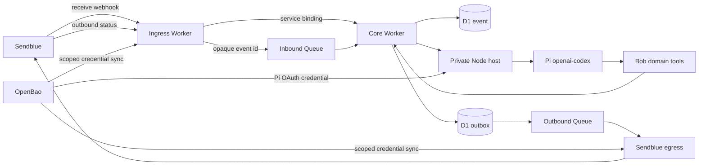

# ADR 0002: Put a durable Sendblue channel before Pi

- Status: Accepted
- Date: 2026-08-10
- Scope: Bob's automatic iMessage channel
- Repository topology: Amended by ADR 0003
- Managed routing: Amended by ADR 0015

## Context

Bob needs an automatic path from iMessage to the agent.

The path must use Sendblue and the owner's ChatGPT subscription.

The path must not depend on OpenAI API-key billing.

Boop Agent is the closest public implementation.

No public project combines Sendblue with Pi.

Boop receives Sendblue webhooks and starts a local Codex app server.

It reuses credentials created by `codex login`.

It also registers its Sendblue receive webhook during startup.

This proves the basic channel and subscription pattern.

Bob still needs stronger durability and access controls.

Bob also uses Pi instead of the Codex app server.

## Reference comparison

| Reference              | Useful pattern                                               | Bob must change                                        |
| ---------------------- | ------------------------------------------------------------ | ------------------------------------------------------ |
| Boop Agent             | Sendblue webhook to subscription-backed Codex                | Use Pi, OpenBao, an allowlist, and durable queues      |
| TextMe                 | One subscription agent, SQLite deduplication, and FIFO work  | Replace polling and broad coding access                |
| OpenClaw Sendblue      | Provider adapter, stable sessions, typing, and deduplication | Fix webhook verification and durable acknowledgment    |
| OpenClaw SMS           | Durable ingress, routing, and outbound failure boundaries    | Adapt the Twilio transport to Sendblue                 |
| Hermes SMS             | Per-sender queues and deterministic sessions                 | Add durable acceptance before success                  |
| Sendblue Chat SDK      | Current payload types and provider actions                   | Add access rules, queues, and persistent state         |
| Codex iMessage Handoff | Sendblue relay and phone pairing                             | Replace local relay and broad Codex access             |
| imessage-coding        | Durable local outbox                                         | Replace URL secrets and early acknowledgment           |
| Codex Maritime         | Allowlist and exact approval binding                         | Replace JSON storage and failed-command acknowledgment |
| Vercel Nitro template  | Separate inference and delivery steps                        | Replace API-key auth and unsafe send retries           |

Boop uses this sequence:

1. Run `codex login` once.
2. Start `codex app-server` with the stored login.
3. Discover the current public tunnel URL.
4. Register a Sendblue receive webhook.
5. Check the `sb-signing-secret` header.
6. Claim `message_handle` in Convex.
7. Return success before the agent finishes.
8. Run the Codex turn.
9. Send the reply through Sendblue.

Bob adopts the shape of this sequence.

Bob does not adopt Boop's failure boundaries.

Boop claims an event before agent work, then returns success.

A crash can leave that event claimed without a durable job.

Boop also accepts any sender with a valid account webhook secret.

Boop does not require the `RECEIVED` message status.

Boop derives its webhook secret from its API secret.

Bob keeps those secrets independent.

## Decision

Use a webhook-first channel with durable ingress and egress.

Keep Sendblue transport separate from Pi and Codex authentication.



Use this stable session key:

```text
agent:main:sendblue:<account-id>:<line-id>:direct:<sender-e164>
```

The session key supports ordering. It does not grant access.

The phone allowlist grants channel access for self-hosting and one fixed Owner.

ADR 0015 defines managed sender authorization and routing.

### Inbound path

1. Sendblue posts a receive event to the ingress Worker.
2. The Worker compares `sb-signing-secret` with timing-safe equality.
3. The Worker rejects an unknown destination line.
4. The Worker rejects a sender outside the phone allowlist.
5. The Worker accepts only inbound `RECEIVED` messages.
6. The Worker validates body size and the complete event schema.
7. The API stores the normalized event in D1.
8. A unique key prevents duplicate provider events.
9. The unique key uses the account, line, and `message_handle`.
10. The Worker publishes only the event identifier to the Queue.
11. The Worker records successful Queue publication.
12. The Worker returns `2xx` after both durable actions succeed.
13. The Worker returns `5xx` when Queue publication fails.

Sendblue can retry a failed delivery.

D1 deduplication makes that retry safe.

Serialize work by account and sender.

Run deterministic channel commands under the same session lock.

### Pi and Codex path

The core Worker loads one stored event and builds the context pack.

It calls the private Node Pi host.

Pi uses the `openai-codex` provider from ADR 0001.

OpenBao remains the Pi OAuth credential authority.

Do not copy a local Codex `auth.json` file into Bob.

Do not send login links or device codes through Sendblue.

Do not expose Sendblue as an unrestricted Pi tool.

The Pi run can use only reviewed Bob domain tools.

### Outbound path

1. Store the outbound intent before calling Sendblue.
2. Record one delivery attempt before each provider call.
3. Send the message through `POST /api/send-message`.
4. Use the inbound sender as `number`.
5. Use Bob's Sendblue line as `from_number`.
6. Store the returned outbound `message_handle`.
7. Process outbound status events through the ingress Worker.
8. Keep provider status separate from task state.

A provider timeout creates an `uncertain` attempt.

Do not retry an uncertain send automatically.

Reconcile provider history before a private retry.

Delivery never means acknowledgment or completion.

Bind `seen`, `done`, and other short replies to one outbound message.

Ask for a choice when more than one action can match.

### Typing behavior

Use native interactions only for direct iMessage events.

Do not use them for SMS, RCS, groups, or events with an unknown service.

Claim one `like` reaction before calling the provider.

Do not retry that reaction after an uncertain result.

Send the reaction and typing start after the durable inbound claim.

Start agent or deterministic work after both provider calls return.

Set `max_duration_ms` to cover the bounded agent run.

Stop it after success, failure, or timeout.

Use `reply_to.message_handle` for the final direct iMessage reply.

Send a standard message after a safe client rejection of the inline reply.

Do not send that fallback after a timeout, rate limit, or server error.

Do not call `mark-read`. Sendblue must enable that endpoint first.

Do not enable Sendblue auto-typing before the live path passes tests.

## Automatic Sendblue configuration

Add one deployment command:

```text
pnpm sendblue:reconcile --environment production
```

The command runs after the ingress Worker has a stable HTTPS URL.

It uses this process:

1. Read scoped Sendblue credentials from OpenBao.
2. Check the public ingress health endpoint.
3. Read the current account webhook configuration.
4. Compare the current global secret with OpenBao.
5. Stop without changes when the secrets differ.
6. Add the missing receive endpoint.
7. Add the missing outbound endpoint.
8. Keep all unrelated webhook endpoints.
9. Read the configuration again.
10. Confirm each required endpoint appears once.
11. Run a private delivery-status test.
12. Ask the allowlisted owner to send `PING`.

Sendblue webhook configuration applies to the complete account.

Never use `PUT` as a blind update.

That method replaces the account webhook configuration.

Use `POST` only for a missing endpoint.

Use `DELETE` only for an exact Bob-owned endpoint.

Provide a read-only check mode for deployments and operations.

Do not change Sendblue during every Worker start.

The Cloudflare URL is stable.

Reconcile after deployment and after an explicit configuration change.

## Rejected choices

### Poll Sendblue

Polling works for a local daemon such as TextMe.

It adds delay and does not fit the Cloudflare ingress design.

### Use Sendblue MCP as the channel

The MCP server provides outbound and account tools.

It is not a durable inbound listener.

It also gives the model more Sendblue authority than Bob needs.

### Run Codex app-server instead of Pi

Boop uses this method successfully.

Bob selected Pi as its provider and tool boundary.

Changing runtimes would break that decision.

### Register webhooks before deployment

Bob does not have a live Worker URL yet.

A placeholder endpoint would drop or expose messages.

## Verification

The channel must pass these tests:

1. A missing or wrong shared secret returns `401`.
2. An unknown line creates no stored event.
3. An unknown sender creates no agent run.
4. Two copies of one `message_handle` create one agent run.
5. A Queue failure returns `5xx` after the D1 insert.
6. A retry publishes the stored event once.
7. An agent crash leaves recoverable work.
8. A provider timeout does not send an automatic duplicate.
9. An outbound callback updates only delivery state.
10. An ambiguous `done` reply changes no task state.
11. The reconciler preserves unrelated account webhooks.
12. A secret mismatch causes no configuration change.
13. A Pi OAuth failure starts no API-key provider.
14. Logs contain no secrets, phone numbers, or message text.
15. One direct iMessage gets one reaction before its action starts.
16. Typing stops after success and failure.
17. SMS, RCS, and group messages use no native interactions.
18. An unsupported inline reply falls back to one standard message.

## Consequences

Bob gets the same automatic channel shape as Boop.

Bob retains Pi, OpenBao, Cloudflare, and narrow tools.

The extra queues add latency and operational work.

They prevent a successful webhook response from losing agent work.

Sendblue still cannot provide exactly-once outbound delivery.

## Sources

- [Boop Agent](https://github.com/raroque/boop-agent)
- [Boop Sendblue receiver](https://github.com/raroque/boop-agent/blob/31979130b1371acd9defbea115279a06c63c1fb4/server/sendblue.ts)
- [Boop Codex app server](https://github.com/raroque/boop-agent/blob/31979130b1371acd9defbea115279a06c63c1fb4/server/runtimes/codex-app-server.ts)
- [Boop webhook reconciler](https://github.com/raroque/boop-agent/blob/31979130b1371acd9defbea115279a06c63c1fb4/scripts/sendblue-webhook.mjs)
- [TextMe](https://github.com/njerschow/textme)
- [OpenClaw Sendblue](https://github.com/njerschow/openclaw-sendblue)
- [OpenClaw SMS gateway](https://github.com/openclaw/openclaw/tree/bdf202ccc8c16449e37317c36069d80427d31cb4/extensions/sms)
- [Hermes SMS adapter](https://github.com/NousResearch/hermes-agent/tree/b614f70361914e85fd2a00dceb7fa2ffcafabe0c/plugins/platforms/sms)
- [Sendblue Chat SDK adapter](https://github.com/sendblue-api/chat-adapter-sendblue)
- [Codex iMessage Handoff](https://github.com/gragland/codex-imessage-handoff)
- [imessage-coding](https://github.com/prbe-ai/imessage-coding)
- [imessage-coding outbox](https://github.com/prbe-ai/imessage-coding/blob/388210fe05357b44c5015204b10b26160c6bc222/packages/device/src/outbox.ts)
- [Codex Maritime](https://github.com/mgritzbach/codex-maritime)
- [Codex Maritime architecture](https://github.com/mgritzbach/codex-maritime/blob/1c8ed2ffba9478986dcfa0d7733f454315ce968e/docs/architecture.md)
- [Vercel Nitro iMessage template](https://github.com/vercel-labs/nitro-imessage-agent-template)
- [Sendblue webhooks](https://docs.sendblue.com/getting-started/webhooks/)
- [Sendblue Chat SDK adapter guide](https://docs.sendblue.com/guides/chat-sdk-adapter/)
- [Sendblue MCP](https://docs.sendblue.com/mcp/)
- [Codex app-server](https://github.com/openai/codex/blob/main/codex-rs/app-server/README.md)
- [OpenAI authentication](https://learn.chatgpt.com/docs/auth)
